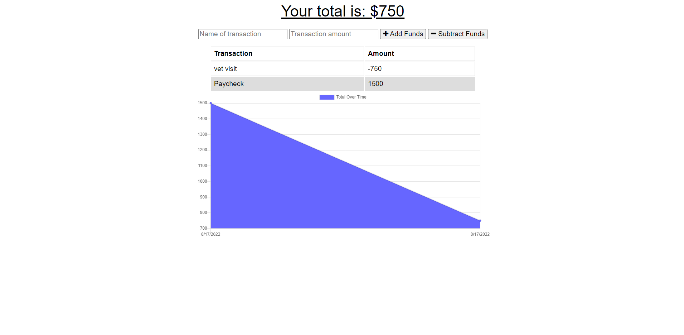

# budget-tracker-pwa

- Github URL: https://github.com/DanielCConlon/budget-tracker-pwa
- Heroku URL: updating heroku deployment
<!-- https://cryptic-eyrie-23348.herokuapp.com/ -->

## Table-of-Contents

- [User Story](#user-story)
- [Description](#description)
- [Installation](#installation)
- [Usage](#usage)
- [Requirements](#requirements)
- [Application](#application)

## [User Story](#table-of-contents)

- AS AN avid traveler
- I WANT to be able to track my withdrawals and deposits with or without a data/internet connection
- SO THAT my account balance is accurate when I am traveling

## [Description](#description)

Update an existing budget tracker application to allow for offline access and functionality. The user will be able to add expenses and deposits to their budget with or without a connection. If the user enters transactions offline, the total should be updated when they're brought back online.

## [Installation](#table-of-contents)

You will just need to run npm i. To download the packages from the package.json.

## [Usage](#table-of-contents)

- Clone the repo
- Open the command line terminal
- Run npm i
- Run npm start
- All good to go

## [Requirements](#table-of-contents)

- GIVEN a budget tracker without an internet connection
- WHEN the user inputs an expense or deposit
- THEN they will receive a notification that they have added an expense or deposit
- WHEN the user reestablishes an internet connection
- THEN the deposits or expenses added while they were offline are added to their transaction history and their totals are updated

## [Application](#table-of-contents)

